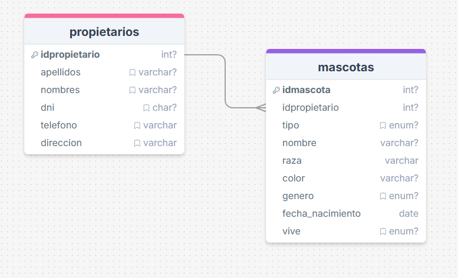

# Sistema de Gestión de Mascotas

Este proyecto es una aplicación en PHP para registrar, listar y generar reportes en PDF de mascotas y propietarios. Utiliza arquitectura MVC y la librería Html2Pdf para crear los reportes.

## Diagrama del Modelo Relacional


*Imagen del diagrama entidad-relación con las tablas y relaciones.*

https://drawsql.app/teams/apolayaschrader/diagrams/tareafinal

---


- `/app`: configuración, controladores, modelos, entidades y vistas.
- `/public`: archivos públicos como CSS y JS.
- `/reports`: plantillas HTML para los reportes PDF.
- `/vendor`: librerías instaladas (Html2Pdf).

## Funcionalidades

- Registrar mascotas y propietarios.
- Listar mascotas con sus propietarios.
- Generar reportes PDF ordenados por ID.

## Base de datos

```sql
CREATE DATABASE veterinaria;
USE veterinaria;

-- Tabla de propietarios
CREATE TABLE propietarios (
  idpropietario INT AUTO_INCREMENT PRIMARY KEY,
  apellidos VARCHAR(40) NOT NULL,
  nombres VARCHAR(40) NOT NULL,
  dni CHAR(8) NOT NULL,
  telefono VARCHAR(15),
  direccion VARCHAR(100)
) ENGINE=InnoDB;

-- Tabla de mascotas
CREATE TABLE mascotas (
  idmascota INT AUTO_INCREMENT PRIMARY KEY,
  idpropietario INT NOT NULL,
  tipo ENUM('Perro', 'Gato', 'Ave', 'Conejo') NOT NULL,
  nombre VARCHAR(40) NOT NULL,
  raza VARCHAR(40),
  color VARCHAR(40) NOT NULL,
  genero ENUM('macho', 'hembra') NOT NULL,
  fecha_nacimiento DATE,
  vive ENUM('si', 'no') NOT NULL DEFAULT 'si',
  CONSTRAINT fk_idpropietario FOREIGN KEY (idpropietario) REFERENCES propietarios(idpropietario)
) ENGINE=InnoDB;
```


